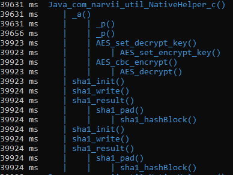

Device ID Bible
============================================= 

:subscript:`Most of this is from okok#7711, I updated it with his help.`

`Download to original <https://cdn.discordapp.com/attachments/844596672574652416/853623881180774410/Device_ID_Generation.docx>`_

Info
----
The Device ID is generated in the Amino App, client-sided, when there is no file called “did” in the data path of the app (/data/data/com.narvii.amino.master/files). It is 82 characters long and valid IDs always start with 18 (which is the version of the Device ID). 

The Device ID consists of 2 SHA1 hashes. 
The Device ID is a unique identifier for the device using the app, it is used to verify the validity of a request by checking if it was made from a real device.

Generating
----------
The Device ID is generated in multiple steps. Those include:  **deviceIdHw(), deviceId1(), deviceId2().** 

| The deviceId1 is the Advertising Client’s ID and the deviceId2 is the device’s android_id. 
| The deviceIdHw is a compilation of multiple hardware based things, e.g. CPU architecture.
| 
| After generating these 3 IDs they are appended into a string which is then hashed with the SHA1 algorithm. 
| The hash hhexdigest is then used in the JNI c function of the NativeHelper library (libnh.so).

The NativeHelper takes the DeviceID version (didsver), appends the hash digest and adds an SHA1 hash at the end.
The key for hashing is generated from R.string.didssec (for further information see :ref:`Didssec <dsec>`.).

Examples
--------
.. code-block:: 

    18E2DB4FFBB513E514C4C9C106E23468BDF29458DC915ACD33ED8CFAC9ABBE798ECF1A8110CC3DB190 (not working)
    1860DF86919B79C25F97CF982FE85185D3EB21DB4674F5A2580F729FC922FEB92E0E1A5EF4176DF69D (working)
    FF0105CDF1B4F07638E5B9791312F71B7A6CDE949BB0 (generated by exception handling of the application)

.. _dsec:

Didssec
------
Didssec is a 32 character long hexadecimal string. The didssec is hardcoded in the strings.xml file. Didssec itself is used for generating the final key for signing the DeviceID. If the app has been modified, the generation will change and a wrong key will be generated which leads to wrong DeviceIDs being generated. Didssec does not change and a constant value is used. 

The didssec is stored in /res/values/strings.xml.

Safety
------
As a safety mechanism, Amino changes didssec along the major updates so that when it is found, that doesn’t matter anymore. Along with that, when trying to install a dumped APK, Amino errors, stating that “important libraries are missing”.

Also, the generation changes if Amino should detect a change in its certs. This can happen when the Amino App has been re-compiled or modified. The change of the generation makes it generate invalid DeviceIDs as seen in the Examples section. If this happens, you’re unable to send requests.

Old Device IDs
--------
Device IDs generated in old versions of the app do not work anymore due to the change of the didssec. In older versions of the App, Amino also didn’t store the ID in a file and rather generated one on start-up each time. This has performance issues.

Replicating
-----------
To replicate Amino’s device ID generation, the key is needed because this is essentially what is checked.

Like a signature. Amino cannot check whether the Values of the SHA1 hash are correct since the hash is a one-way function. This makes it easier to reverse engineer since one only has to find the algorithm used to generate the ID and the key.

The device ID generation is however made more difficult by putting the final functions in Java’s JNI to make it harder to decompile since decompiling results in unreadable code.

Due to the fact, that Amino changes the key when a change in software is detected, replication is further made difficult as you cannot print the value to logcat or modify the app so that it shows the value.

Instead, the application has to be hooked by a tool like “Frida” which allows hooking to Android Processes and allows the use of instances of functions in the application. Which could be used as another way to print out the value by hooking to the “DeviceIDService” Class which contains the functions used to generate the Device IDs.

After that key is grabbed the replication is as simple as hashing random values and appending 18 to it.
Frida can also be used here to use function hooks and logging of the buffers for each argument and return value. This is the easiest way to do it as Frida does everything for you, apart from coding the hooks.

Notes
-----
* The Device ID length is NOT checked server side; it can theoretically be longer or shorter than 82 characters
* The Device ID is mandatory for EVERY request made by the App
* The Web version does not use Device IDs
* The Device ID is partially used for identifying devices for rate limiting when the IP is not used
* The Device ID MUST be hexadecimal characters only, anything other than that WILL result in an error
* On version 3.4.33571, the Device ID algorithm was changed. Device ID's used to start with 01 before this change.